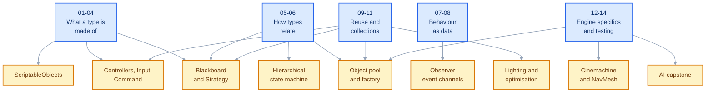

# COMP I8014 — 3D Game Engine Development

C# foundations for the module. Everything here is plain C# — you will not open Unity for any of it.

That is deliberate. Every topic below exists because a later topic needs it: the state machine cannot be written without interfaces, the event channels cannot be written without delegates, and the object pool cannot be written without generics. Learning them against the engine as well as the language means debugging two things at once. Learning them first means the Unity work starts with only Unity to think about.

Use this alongside Moodle and the official [module descriptor](https://courses.dkit.ie/index.cfm/page/module/moduleId/55573/deliveryperiodid/1082).

---

## Contents

- [1. What you are assumed to know](#1-what-you-are-assumed-to-know)
- [2. Module content](#2-module-content)
- [3. What each topic unblocks](#3-what-each-topic-unblocks)
- [4. Getting started](#4-getting-started)
- [5. How to use this repo](#5-how-to-use-this-repo)
- [6. Suggested order of work](#6-suggested-order-of-work)
- [7. If you are already confident](#7-if-you-are-already-confident)
- [8. Folder map](#8-folder-map)

---

## 1. What you are assumed to know

From your previous programming modules:

- Classes, fields, methods and constructors
- Access modifiers, and basic inheritance
- Simple collections, at the level of "I have used a list"

Nothing beyond that. If a note uses a concept, it has been introduced in an earlier note — the sequence below is a dependency order, not a difficulty order, and reading it out of sequence will cost you more than it saves.

Explicitly **out of scope** here, and not needed for anything in these notes: `async`/`await`, `Task`, coroutines, records, pattern matching beyond a basic `switch`, reflection, and dependency-injection frameworks.

---

## 2. Module content

Notes **01-08** are covered in class. Notes **09-14** are self-study across the semester, in the order shown — each is needed before the topic named in section 6.

| # | Topic | Requires | Notes | Exercises |
|:--|:--|:--|:--|:--|
| 01 | **Properties, static members and ToString** — controlling access to state, validation in a setter, members that belong to the type | — | [Notes](notes/01-properties-static-tostring.md) | [Exercises](exercises/01-properties-static-tostring.md) |
| 02 | **Struct and class, value semantics** — what copies and what is shared, and why `transform.position.x = 5f` does not compile | 01 | [Notes](notes/02-value-semantics.md) | [Exercises](exercises/02-value-semantics.md) |
| 03 | **Operator overloading and equality** — arithmetic on your own types, and the four members `==` drags in with it | 01, 02 | [Notes](notes/03-operator-overloading.md) | [Exercises](exercises/03-operator-overloading.md) |
| 04 | **ref and out** — opting out of pass-by-value, and the `Try` pattern that uses it | 02 | [Notes](notes/04-ref-and-out.md) | [Exercises](exercises/04-ref-and-out.md) |
| 05 | **Interfaces** — programming to a contract, keeping contracts small, resolving a collision | 01 | [Notes](notes/05-interfaces.md) | [Exercises](exercises/05-interfaces.md) |
| 06 | **Abstract classes and interfaces** — shared state and behaviour, and why the two are a pair rather than a choice | 05 | [Notes](notes/06-abstract-vs-interface.md) | [Exercises](exercises/06-abstract-vs-interface.md) |
| 07 | **Delegates, events, Action and Func** — storing a method in a variable, and restricting who may raise it | 06 | [Notes](notes/07-delegates-events-action-func.md) | [Exercises](exercises/07-delegates-events-action-func.md) |
| 08 | **Lambdas and closures** — anonymous methods, and what capture really does | 07 | [Notes](notes/08-lambdas-and-closures.md) | [Exercises](exercises/08-lambdas-and-closures.md) |
| 09 | **Generics** — one implementation, many types, and the constraints that make `T` usable | 05, 08 | [Notes](notes/09-generics.md) | [Exercises](exercises/09-generics.md) |
| 10 | **Collections and LINQ** — choosing by access pattern, and keeping LINQ out of the per-frame path | 04, 09 | [Notes](notes/10-collections-and-linq.md) | [Exercises](exercises/10-collections-and-linq.md) |
| 11 | **Predicates, comparisons and List search** — passing a condition as a value, without the allocation | 10 | [Notes](notes/11-predicates-list-search.md) | [Exercises](exercises/11-predicates-list-search.md) |
| 12 | **Enums, Flags and extension methods** — a set of values in one integer, and vocabulary for types you do not own | 01, 04 | [Notes](notes/12-enums-and-extension-methods.md) | [Exercises](exercises/12-enums-and-extension-methods.md) |
| 13 | **Null handling in Unity** — why a destroyed object reports as null through `==` and not through `?.` | 03, 07 | [Notes](notes/13-null-handling-in-unity.md) | [Exercises](exercises/13-null-handling-in-unity.md) |
| 14 | **Unit testing with xUnit** — turning the "done when" lists into something a machine checks | 01-12 | [Notes](notes/14-unit-testing.md) | [Exercises](exercises/14-unit-testing.md) |

Worked solutions are in [code/solutions/](code/solutions/), one folder per exercise file with a separate file for A, B and C. The xUnit suite in [code/tests/](code/tests/) covers the B and C solutions and expresses the "done when" criteria in runnable form - see [code/README.md](code/README.md) for how to run it, and [note 14](notes/14-unit-testing.md) for how to write your own.

---

## 3. What each topic unblocks

Each topic here exists to make a later one possible. Read this when a note feels like revision — the lower row is why it is not.



Blue is what you learn here, amber is what it unlocks. For the dependency between individual notes, see the **Requires** column in [section 2](#2-module-content); each note also opens by naming what it makes possible.

---

## 4. Getting started

- Install the **.NET SDK**, version 8 or newer. Check with `dotnet --version`.
- You do not need Unity for anything in this repository. Where a note or exercise uses a Unity type, a minimal stand-in is supplied so the code runs in a console project.
- Create a console project to work in: `dotnet new console -o week01` then `cd week01` and `dotnet run`.
- Read the notes in your IDE's Markdown preview, or on GitHub, so the Mermaid diagrams render.
- Check the tests run: from `code/tests`, `dotnet test`. Every test should pass before you change anything.

---

## 5. How to use this repo

- Read the **note** first. Each one opens with what it unblocks, so you know why you are reading it before you read it.
- Work the **exercises** in order. Each file has three:
  - **A — mechanical.** Apply the syntax. Short.
  - **B — applied.** Solve a small problem where the topic is the natural tool.
  - **C — design.** Open-ended, with more than one defensible answer, requiring you to justify a choice in a comment. This is where the marks separate.
- Pay particular attention to the **Common mistakes** section in each note. Each entry gives the wrong code, the symptom you will actually observe, and the fix. Most of them are drawn from things that go wrong every year.
- Finish on **Check yourself** and compare against the collapsed answers beneath it.
- Attempt the exercise before opening the [worked solution](code/solutions/), then **compare approaches** rather than checking for a match. A solution is one defensible route, not the answer; reading one feels like understanding, but only writing the code builds it. Every solution file opens with the design choice it made and what the alternative would have cost - that comment is the part worth reading closely.

---

## 6. Suggested order of work

Five contact hours cover notes 01-08. The remaining notes are self-study, spread across the semester and taken before the topic each one unblocks.

| Hour | Cover | Then |
|:--|:--|:--|
| 1 | 01 Properties, 02 Value semantics | Exercises 01A-B, 02A |
| 2 | 03 Operators, 04 ref and out | Exercises 03A-B, 04A |
| 3 | 05 Interfaces, 06 Abstract classes | Exercises 05A-B, 06A |
| 4 | 07 Delegates and events | Exercises 07A-B |
| 5 | 08 Lambdas and closures | Exercises 08A-B, then start any C |

Exercise C in each file is deliberately open and is best done in your own time, when you can sit with the design question rather than rush it.

For the self-study notes, the useful deadlines are:

- **09 Generics** and **11 Predicates** before the object pool
- **10 Collections and LINQ** before the command topic
- **12 Enums and extension methods** before Cinemachine and NavMesh
- **13 Null handling** before the AI capstone — and read it twice
- **14 Unit testing** before the coding exam, so you can check your own work under exam conditions

---

## 7. If you are already confident

Skip the notes and go straight to the exercises. They are the honest test.

Start with exercise **B** in any file. If you can complete B without referring to the note, you can skip that note. If you cannot, read it.

Three specific checks, each of which catches most people who believe they know C#:

- **Note 02, exercise B.** Write code that actually moves a transform when `Position` is a property returning a struct.
- **Note 08, exercise B.** Three closure bugs in a program that compiles, runs and throws nothing.
- **Note 13, exercise A.** Ten lines of null checks. Four are unsafe. Identify which without running anything.

If those three give you no trouble, work through the exercise **C** tasks only. They are open design problems and remain worth doing regardless of how much C# you already have.

---

## 8. Folder map

```text
notes/              One note per topic, numbered in reading order
exercises/          One exercise file per note, numbered to match
code/solutions/     Worked solutions, one folder per exercise file
code/tests/         One xUnit project covering every B and C solution
```

Every note carries YAML frontmatter recording its topic code, prerequisites and position in the sequence, and ends with a `Lesson Context` block naming the preceding topic. If the two ever disagree, the frontmatter is correct.
