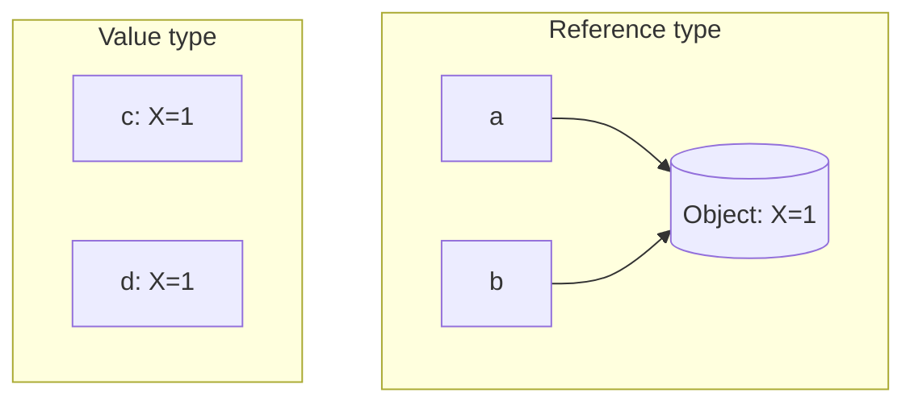

# Struct and Class: Value Semantics

## What this unblocks

The first time you write movement code you will type `transform.position.x = 5f`, watch it fail to compile, and need to know why. The answer is this note.

It also underpins [note 04](04-ref-and-out.md): `ref` and `out` only mean anything once you understand that arguments are copied by default. And it decides, every time you declare a type for the rest of the module, whether you write `class` or `struct`.

This is a rule about how the language stores things. Misunderstanding it produces code that compiles, runs, and silently does nothing.

## The idea

A `class` is a **reference type**. A variable holds a reference to an object somewhere else, and copying the variable copies the reference. Two variables can point at one object.

A `struct` is a **value type**. The variable holds the data itself, and copying the variable copies the data. Two variables are always two separate sets of data.



In the reference case there is one object with two names. In the value case there are two independent copies that happen to hold the same number.

## In code

### The distinction

```csharp
public class PositionClass
{
    public float X;
}

public struct PositionStruct
{
    public float X;
}
```

```csharp
PositionClass a = new PositionClass();
a.X = 1f;
PositionClass b = a;
b.X = 99f;
Debug.Log(a.X);             // 99 - a and b are the same object

PositionStruct c = new PositionStruct();
c.X = 1f;
PositionStruct d = c;
d.X = 99f;
Debug.Log(c.X);             // 1 - d was a copy
```

The same rule applies to method arguments. Passing a struct to a method passes a copy, so a method that modifies its struct parameter modifies nothing the caller can see:

```csharp
private void Nudge(PositionStruct position)
{
    position.X += 1f;       // modifies the copy, and then the copy is discarded
}
```

This compiles without warning and does nothing. It is the source of a great deal of confusion, and it is exactly what the next part is about.

### Why transform.position.x = 5f does not compile

Unity's `Vector3` is a struct. `Transform.position` is a property, not a field, which means it is a pair of methods and reading it runs the getter. Properties are [note 01](01-properties-static-tostring.md); this is the first place the distinction bites.

So `transform.position` does not give you the vector inside the transform. It gives you a *copy* of it, returned from the getter.

```csharp
transform.position.x = 5f;      // does not compile
```

**Error:** The compiler reports that you cannot modify the return value of `Transform.position`, because it is not a variable.

Read the error literally, because it is precise. The thing on the left of the assignment is the value the getter returned. It has no permanent home - it is not a variable - so writing to its `x` would set a field on a temporary copy that is discarded on the next line. The change could not possibly reach the transform.

The compiler could have let this through and left you with a line that quietly does nothing. It refuses instead, which is the correct decision and the reason this is a compile error rather than a bug.

The fix is to make the copy explicit, modify it, and assign it back:

```csharp
Vector3 position = transform.position;      // copy out
position.x = 5f;                            // modify the copy
transform.position = position;              // copy back in, via the setter
```

Three lines, and each one has to be there. The last line is the one that actually moves the object, because it calls the property's setter and the setter is what tells the engine the transform has changed.

The shorter form constructs a new vector rather than modifying one:

```csharp
transform.position = new Vector3(5f, transform.position.y, transform.position.z);
```

Both are correct. The three-line version is usually clearer, and in [note 12](12-enums-and-extension-methods.md) you will see it wrapped up behind a single call.

You will meet this again with `transform.localScale`, `transform.eulerAngles`, and every other struct-valued property in the engine. The rule is the same every time: **you cannot modify a struct through a property, only replace it.**

### Which should you write

Almost always a class. The cases for a struct are narrow:

- It is small, in the region of sixteen bytes or so.
- It represents a single value rather than an entity with identity - a point, a colour, a range.
- It is genuinely immutable in use, or close to it.

`Vector3` qualifies on all three counts, which is why the engine made it a struct: they are created constantly, and forcing a heap allocation for every position calculation would be intolerable.

Your own game types - enemies, weapons, states, pools - are entities with identity and behaviour. Those are classes. When in doubt, write a class; the copying rules on a struct will catch you out far more often than the allocation of a class will cost you.

## Common mistakes

### Modifying a struct returned by a property

```csharp
transform.position.x = 5f;                  // will not compile
rigidbody.velocity.y = 0f;                  // will not compile
```

**Symptom:** The compiler refuses to let you modify the return value, because it is not a variable.

**Fix:** Copy into a local, modify the local, assign it back. The assignment back is not optional, and it is the step people leave out.

### Expecting a struct to behave like a class

```csharp
private void ApplyKnockback(Vector3 velocity)
{
    velocity += Vector3.up * 5f;            // modifies a copy
}

// caller
Vector3 v = GetVelocity();
ApplyKnockback(v);
// v is unchanged
```

**Symptom:** No error, no warning, and no effect. The method looks correct, runs, and the caller sees nothing change. This is harder to spot than the compile error above precisely because there is nothing to spot.

**Fix:** Return the new value rather than trying to modify the parameter - `v = ApplyKnockback(v);` - which is how the engine's own vector operations are designed. Every `Vector3` method returns a new vector rather than changing the one you called it on.

### Modifying a struct stored in a List

```csharp
List<PositionStruct> positions = new List<PositionStruct>();
positions.Add(new PositionStruct());

positions[0].X = 5f;                        // will not compile
```

**Symptom:** The compiler reports that the return value cannot be modified, for exactly the reason above: the list's indexer is a property, so it handed you a copy.

**Fix:** Take the item out, change it, put it back.

```csharp
PositionStruct p = positions[0];
p.X = 5f;
positions[0] = p;
```

An array does not behave this way - `array[0].X = 5f` compiles, because an array indexer gives direct access rather than returning a copy. That inconsistency catches people out, so be sure which one you are holding.

### Giving a struct a parameterless constructor and expecting it to run

```csharp
PositionStruct p = new PositionStruct();     // fields are zeroed, not initialised by you
PositionStruct[] all = new PositionStruct[10];  // ten zeroed structs, no constructor called
```

**Symptom:** Fields hold `0`, `false` or `null` when you expected your own defaults. Creating an array of structs never calls any constructor at all.

**Fix:** Do not rely on construction to establish a valid state in a struct. Either make the zero value meaningful, or use a class, where you control every path to an instance.

## Check yourself

1. `transform.position.x = 5f` does not compile. What exactly is the compiler objecting to?
2. A method takes a `Vector3` parameter and modifies it. What does the caller see?
3. Why did Unity make `Vector3` a struct rather than a class?
4. `array[0].X = 5f` compiles but `list[0].X = 5f` does not. Why?
5. You are designing a type to hold an enemy's current health, target and state. Struct or class?

<details>
<summary>Answers</summary>

**1.** That the left-hand side is the return value of a property getter, not a variable. Because `Vector3` is a struct, the getter returned a copy; assigning to a field of that copy would change something that is discarded immediately, so the compiler rejects it rather than letting you write a line that does nothing.

**2.** Nothing. `Vector3` is a value type, so the method received a copy, and the copy is discarded when the method returns. Return the modified value instead.

**3.** Because vectors are small, have no identity, and are created constantly - several times per object per frame. Making it a class would mean a heap allocation for every intermediate result in every position calculation.

**4.** An array indexer gives you direct access to the element itself. A `List<T>` indexer is a property, so reading it runs a getter that returns a copy - and you cannot modify a copy that has nowhere to live.

**5.** A class. It has identity - this particular enemy - it holds a reference to another object, and it is mutated constantly. All three point away from a struct.

</details>

## Further reading

- [Choosing between class and struct](https://learn.microsoft.com/en-us/dotnet/standard/design-guidelines/choosing-between-class-and-struct)
- [Structure types (C# reference)](https://learn.microsoft.com/en-us/dotnet/csharp/language-reference/builtin-types/struct)
- [Transform.position in the Unity scripting reference](https://docs.unity3d.com/ScriptReference/Transform-position.html)

## Lesson Context

```yaml
previous_lesson:
  topic_code: t01_properties

this_lesson:
  topic_code: t02_value_semantics
  difficulty_tier: Foundation
mlos: [MLO3]
```
