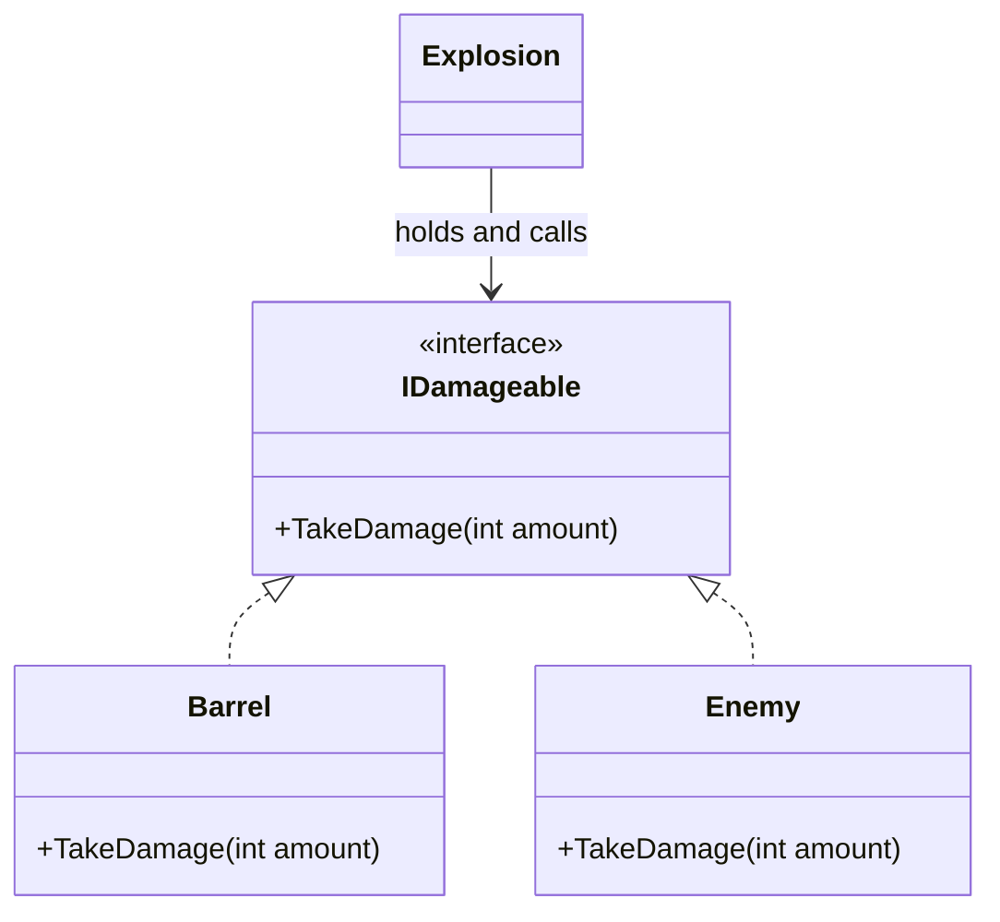

# Interfaces

## What this unblocks

Later in the module you will build a hierarchical finite state machine. Every state in it - patrol, chase, attack - implements one common interface, so the machine can hold the current state in a single field and call it without knowing which state it actually is. The same move appears in the strategy topic, where interchangeable behaviours sit behind a single contract, and again in the object pool, which accepts anything that can be reset and reused regardless of what it is.

All three depend on one idea: a type can promise *what* it does without committing to *how*. That is what an interface gives you.

## The idea

An interface is a contract. It names the members a type must provide and supplies no implementation of its own. A type that declares the interface is promising to supply every member on that list.

The value is not in the promise. It is in what the promise lets the *caller* forget. Code that holds an `IDamageable` can call `TakeDamage` without knowing whether it is holding a barrel, an enemy or a door, and it does not need changing when you add a fourth kind of target next week. This is what is meant by programming to the interface rather than to the implementation.



`Explosion` has an arrow to the interface and to nothing else. It has no knowledge of `Barrel` or `Enemy` at all.

## In code

### Declaring and implementing an interface

An interface declares members without bodies. Members are public by definition, so you do not write an access modifier on them.

```csharp
/// <summary>
/// A target that can receive damage.
/// </summary>
public interface IDamageable
{
    /// <summary>
    /// Applies damage to this target.
    /// </summary>
    /// <param name="amount">Points of damage to apply.</param>
    void TakeDamage(int amount);
}
```

Two unrelated types can both satisfy it. They share no base class and nothing else in common.

```csharp
public class Barrel : IDamageable
{
    private int _integrity = 20;

    /// <inheritdoc />
    public void TakeDamage(int amount)
    {
        _integrity -= amount;

        if (_integrity <= 0)
        {
            Explode();
        }
    }

    private void Explode()
    {
        // Spawn effect, remove from the scene.
    }
}

public class Enemy : IDamageable
{
    private int _health = 100;
    private bool _isAlerted;

    /// <inheritdoc />
    public void TakeDamage(int amount)
    {
        _health -= amount;
        _isAlerted = true;
    }
}
```

The implementing member must be `public`, even though the interface did not say so. The `<inheritdoc />` tag tells the documentation tooling to reuse the comment from the interface, so the contract is described in exactly one place.

### Programming to the interface

Now the payoff. `Explosion` never names a concrete type.

```csharp
/// <summary>
/// Applies damage to a set of targets at once.
/// </summary>
public class Explosion
{
    private readonly List<IDamageable> _targets = new List<IDamageable>();

    /// <summary>
    /// Registers a target to be damaged when this explosion detonates.
    /// </summary>
    /// <param name="target">The target to register.</param>
    public void Add(IDamageable target)
    {
        _targets.Add(target);
    }

    /// <summary>
    /// Damages every registered target.
    /// </summary>
    /// <param name="damage">Points of damage to apply to each target.</param>
    public void Detonate(int damage)
    {
        foreach (IDamageable target in _targets)
        {
            target.TakeDamage(damage);
        }
    }
}
```

Add a `Door` that implements `IDamageable` and `Explosion` handles it with no edit. That property - new implementations cost the caller nothing - is the whole reason the state machine is built this way.

### Implementing more than one interface

A class has exactly one base class but any number of interfaces. Each one is a separate promise.

```csharp
/// <summary>
/// A target whose condition can be restored.
/// </summary>
public interface IRepairable
{
    /// <summary>
    /// Restores condition to this target.
    /// </summary>
    /// <param name="amount">Points of condition to restore.</param>
    void Repair(int amount);
}

public class Door : IDamageable, IRepairable
{
    private int _integrity = 50;

    /// <inheritdoc />
    public void TakeDamage(int amount)
    {
        _integrity -= amount;
    }

    /// <inheritdoc />
    public void Repair(int amount)
    {
        _integrity += amount;
    }
}
```

A caller that only repairs takes an `IRepairable` and is blind to the damage side. A caller that only damages takes an `IDamageable`. The same object serves both, and neither caller knows the other exists.

### Keeping interfaces small

The temptation is to write one large interface covering everything an object might do. It does not survive contact with a second implementer.

```csharp
// Do not do this.
public interface IEntity
{
    void TakeDamage(int amount);
    void Repair(int amount);
    void Move(float x, float y, float z);
}

public class Barrel : IEntity
{
    public void TakeDamage(int amount) { /* fine */ }

    public void Repair(int amount) { /* fine */ }

    public void Move(float x, float y, float z)
    {
        throw new NotImplementedException("Barrels do not move.");
    }
}
```

A barrel is damageable and repairable, but it does not move. The compiler forces a `Move` body onto it anyway, and the only honest body is one that fails. The contract now lies: anything holding an `IEntity` is entitled to call `Move` and will be punished for it at run time.

The fix is to split the contract along the lines the implementers actually divide on, and let each type declare only what it can honour.

```csharp
public interface IMovable
{
    void Move(float x, float y, float z);
}

public class Barrel : IDamageable, IRepairable { /* no Move */ }

public class Enemy : IDamageable, IMovable { /* no Repair */ }
```

This is interface segregation: several small contracts beat one large one, because no type is ever forced to implement something it cannot do. The practical test is simple. If you are writing `NotImplementedException` to satisfy an interface, the interface is too big.

### When two interfaces collide

Small interfaces get written independently, so sooner or later two of them will declare a member with the same signature. In this module that pair is `IState` and `IPoolable`, and the colliding member is `Reset`.

```csharp
public interface IState
{
    void Reset();
}

public interface IPoolable
{
    void Reset();
}
```

A single `public void Reset()` satisfies both, but it gives both callers the same behaviour, which is rarely what you want. Resetting a state means returning it to its entry condition; resetting a pooled object means wiping it clean for whoever takes it next. Explicit implementation lets you supply a separate body for each.

```csharp
public class Turret : IState, IPoolable
{
    private int _ammunition;
    private float _timeInState;

    void IState.Reset()
    {
        _timeInState = 0f;
    }

    void IPoolable.Reset()
    {
        _timeInState = 0f;
        _ammunition = 0;
    }
}
```

Note what is missing: explicitly implemented members take no access modifier. The interface name in front of the method is what marks them. They are also not visible on the concrete type, so this will not compile:

```csharp
Turret turret = new Turret();
turret.Reset();                       // error: no such member
```

You have to say which contract you are speaking through:

```csharp
IPoolable poolable = turret;
poolable.Reset();                     // clears the timer and the ammunition

((IState)turret).Reset();             // clears the timer only
```

That is the trade-off. Explicit implementation resolves the collision and hides the member from anyone holding the concrete type. Occasionally that hiding is useful on its own, but mostly it is a cost you accept in order to get the collision resolved.

## Common mistakes

### Putting an access modifier on an interface member

```csharp
public interface IDamageable
{
    public void TakeDamage(int amount);     // wrong
}
```

**Symptom:** The compiler rejects the modifier, reporting that `public` is not valid for this item.

**Fix:** Drop the modifier. Interface members are public by definition, and saying so again is either an error or, on newer language versions, a statement about something else entirely.

### Forgetting `public` on the implementing member

The mirror image of the previous mistake, and far more common.

```csharp
public class Barrel : IDamageable
{
    void TakeDamage(int amount) { }         // implicitly private
}
```

**Symptom:** The compiler reports that `Barrel` does not implement the interface member `IDamageable.TakeDamage(int)`, because `Barrel.TakeDamage(int)` is not public. The method is visibly right there, which makes the message read as nonsense until you notice the missing modifier.

**Fix:** Add `public`. Implementing an interface means exposing the member - unless you are implementing it explicitly, in which case you write `void IDamageable.TakeDamage(int amount)` and no modifier at all.

### Expecting an interface reference to see the concrete type's extras

```csharp
foreach (IDamageable target in _targets)
{
    target.TakeDamage(10);
    target.Explode();                       // wrong
}
```

**Symptom:** The compiler reports that `IDamageable` does not contain a definition for `Explode`, even though the `Barrel` sitting in that list plainly has one.

**Fix:** Decide which is actually true. If every target must be able to explode, it belongs in the contract. If only some can, it does not, and reaching for it here means this loop wants a different abstraction. Casting to `Barrel` to get at it does work, and defeats the entire point: the caller is coupled to a concrete type again.

### Calling an explicitly implemented member on the concrete type

```csharp
Turret turret = new Turret();
turret.Reset();                             // wrong
```

**Symptom:** The compiler reports that `Turret` does not contain a definition for `Reset`. This one is genuinely disorienting, because the class contains two methods called `Reset` and the compiler is insisting there are none.

**Fix:** Reach it through the interface - `((IState)turret).Reset()` - or hold the object in an interface-typed variable to begin with, which is what you should be doing anyway.

## Check yourself

1. Why does `Explosion` hold a `List<IDamageable>` rather than a `List<Enemy>`?
2. A class can inherit from one base class. How many interfaces can it implement?
3. You add a method to an interface that four classes already implement. What happens?
4. When is explicit implementation necessary rather than merely available?
5. You are writing an implementation and the only sensible body for one member is `throw new NotImplementedException()`. What is that telling you?

<details>
<summary>Answers</summary>

**1.** So that it works with every current and future damageable type without being edited. A `List<Enemy>` would mean that adding barrels requires a second list, a second loop and a change to `Detonate`.

**2.** Any number. This is the main practical difference between the two, and it is the subject of [note 06](06-abstract-vs-interface.md).

**3.** Four compiler errors, one per implementer, until each supplies the new member. Widening a contract is never free, which is an argument for keeping interfaces narrow from the start.

**4.** When one type implements two interfaces that declare the same member signature and the two callers need different behaviour from it. A single implicit implementation can only give them the same behaviour.

**5.** That the interface is too big - it is demanding something this type cannot do. Split it, so that each type declares only the contracts it can honour.

</details>

## Further reading

- [Interfaces - define behaviour for multiple types](https://learn.microsoft.com/en-us/dotnet/csharp/fundamentals/types/interfaces)
- [Explicit interface implementation](https://learn.microsoft.com/en-us/dotnet/csharp/programming-guide/interfaces/explicit-interface-implementation)
- [Choosing between class and interface](https://learn.microsoft.com/en-us/dotnet/standard/design-guidelines/choosing-between-class-and-interface)

## Lesson Context

```yaml
previous_lesson:
  topic_code: t04_ref_and_out

this_lesson:
  topic_code: t05_interfaces
  difficulty_tier: Foundation
mlos: [MLO3]
```
