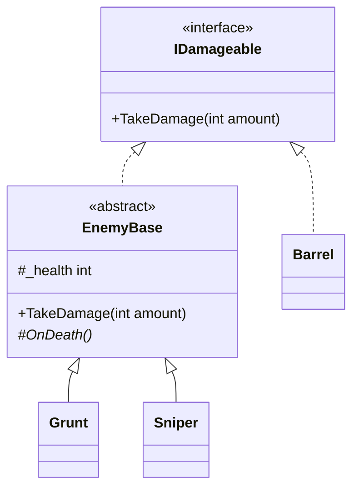

# Abstract classes and interfaces

## What this unblocks

The states of your finite state machine will not implement `IState` directly. They will derive from `abstract class StateBase : IState`, because every state needs the same three or four lines of bookkeeping and nobody wants to write them eight times. The machine still holds its current state as an `IState`, so it remains blind to the base class entirely.

That combination - an interface for the caller, an abstract base for the implementers - is one of the most common shapes in engine code. This note is about why it is a pair rather than a choice.

## The idea

[Note 05](05-interfaces.md) established what an interface does: it states a contract and carries no implementation. An abstract class is the opposite trade. It can hold fields, constructors, and finished method bodies, but a type may derive from only one of them.

So they answer different questions:

- An interface answers *what can a caller rely on?*
- An abstract class answers *what do the implementers have in common?*

Those are not competing answers, which is why the two appear together so often. The interface faces outwards, towards code that consumes the type. The abstract class faces inwards, towards the family of types that share plumbing.



Note `Barrel`. It satisfies the same contract without touching the base class, because it has nothing in common with an enemy. Code that holds an `IDamageable` treats all four the same way and cannot tell which route a given object took.

## In code

### An abstract class

Mark the class `abstract` and it cannot be instantiated. Mark a member `abstract` and it has no body, so every concrete subclass must supply one.

```csharp
/// <summary>
/// Shared health bookkeeping for enemies.
/// </summary>
public abstract class EnemyBase : IDamageable
{
    private int _health;

    /// <summary>
    /// Creates an enemy with a starting health value.
    /// </summary>
    /// <param name="startingHealth">Health the enemy begins with.</param>
    protected EnemyBase(int startingHealth)
    {
        _health = startingHealth;
    }

    /// <summary>
    /// Gets a value indicating whether this enemy has run out of health.
    /// </summary>
    public bool IsDead
    {
        get { return _health <= 0; }
    }

    /// <inheritdoc />
    public void TakeDamage(int amount)
    {
        if (IsDead)
        {
            return;
        }

        _health -= amount;

        if (IsDead)
        {
            OnDeath();
        }
    }

    /// <summary>
    /// Called once when health reaches zero.
    /// </summary>
    protected abstract void OnDeath();
}
```

Three things are doing work here that an interface could not do.

`_health` is a field. Interfaces cannot declare fields, so shared *state* is always a reason to reach for a class.

The constructor is `protected`. Nobody can call `new EnemyBase(100)`, but every subclass must call it, which guarantees the invariant that health is initialised.

`TakeDamage` is written once and is not virtual. The guard against damaging a corpse now holds for every enemy in the game, and a subclass cannot forget it. `OnDeath` is the single hole left open for subclasses to fill.

### A subclass

```csharp
public class Grunt : EnemyBase
{
    /// <summary>
    /// Creates a grunt with the standard grunt health.
    /// </summary>
    public Grunt() : base(40)
    {
    }

    /// <inheritdoc />
    protected override void OnDeath()
    {
        // Drop ammunition.
    }
}
```

`: base(40)` passes up to the protected constructor. `override` is required; leaving it off is a compiler error for an abstract member, and a subtler problem for a virtual one, which is covered under common mistakes below.

### Abstract, virtual, neither

Three options for a method on a base class, and choosing between them is most of the design work:

| Modifier | Body in the base | Subclass must override | Use when |
|---|---|---|---|
| `abstract` | No | Yes | Every subclass differs and there is no sensible default |
| `virtual` | Yes | No | There is a sensible default that some subclasses will replace |
| neither | Yes | Cannot | The behaviour is fixed and subclasses must not vary it |

The last row is the one students use least and should use most. A non-virtual method is a guarantee. `TakeDamage` above is non-virtual on purpose: the contract says damage reduces health and death fires once, and no subclass gets a vote.

```csharp
public abstract class EnemyBase : IDamageable
{
    /// <summary>
    /// Gets the multiplier applied to incoming damage.
    /// </summary>
    protected virtual float DamageMultiplier
    {
        get { return 1f; }
    }
}

public class Sniper : EnemyBase
{
    /// <inheritdoc />
    protected override float DamageMultiplier
    {
        get { return 2f; }
    }
}
```

Most enemies want the default and say nothing. `Sniper` opts out.

### Which to declare on the caller

This is the decision that matters, and the rule is short: **callers take the interface**.

```csharp
// Good. Works with Grunt, Sniper, Barrel, and anything added later.
public void ApplySplash(IDamageable target, int damage)
{
    target.TakeDamage(damage);
}

// Worse. Barrel can never be passed to this, for no good reason.
public void ApplySplash(EnemyBase target, int damage)
{
    target.TakeDamage(damage);
}
```

The second version has quietly narrowed the contract from "anything damageable" to "anything damageable that happens to reuse our enemy plumbing". Those are different requirements and the caller only ever needed the first.

The abstract base is an implementation convenience. It should not appear in a method signature unless the method genuinely needs something only the base provides.

### A note on default interface members

Recent versions of C# allow an interface member to carry a body. This narrows the gap between the two constructs, and you will see it mentioned online. We do not use it in this module: it complicates the rules about which implementation wins, and Unity projects do not generally need it. Treat interfaces as body-free.

### Choosing between them

| Question | Answer |
|---|---|
| Do implementers share state or constructor logic? | Abstract class |
| Might an implementer already have a base class? | Interface |
| Do you need several unrelated types to satisfy one contract? | Interface |
| Do you want to guarantee behaviour a subclass cannot change? | Abstract class |
| Are you describing a capability rather than a family? | Interface |

Capability against family is the most useful phrasing. `IDamageable` is a capability: barrels, doors and enemies have nothing to do with each other but all have it. `EnemyBase` is a family: the things deriving from it are variations on one theme. `StateBase` is a family, sitting behind the `IState` capability, which is exactly the arrangement in the diagram above.

## Common mistakes

### Instantiating the abstract class

```csharp
EnemyBase enemy = new EnemyBase(100);       // wrong
```

**Symptom:** The compiler refuses, reporting that it cannot create an instance of the abstract type `EnemyBase`.

**Fix:** Instantiate a concrete subclass. The variable may still be typed as `EnemyBase`, or better as `IDamageable`; it is the `new` that is illegal, not the type of the variable.

### Hiding a virtual method instead of overriding it

```csharp
public class Sniper : EnemyBase
{
    protected float DamageMultiplier                 // wrong: no override
    {
        get { return 2f; }
    }
}
```

**Symptom:** A compiler warning about hiding an inherited member, and then the bug the warning was about: damage is calculated with the base value of `1f` even though `Sniper` clearly says `2f`. Calls made through an `EnemyBase` reference run the base version, whilst calls through a `Sniper` reference run the new one, so the same object behaves differently depending on how you are holding it.

**Fix:** Add `override`. If you genuinely meant to hide rather than override, write `new` explicitly so the intent is on the page - but you almost never mean this, and in this module you should treat the warning as an error.

### Putting shared state in the interface

```csharp
public interface IDamageable
{
    int Health { get; set; }                // suspicious
    void TakeDamage(int amount);
}
```

**Symptom:** It compiles, and then every implementer separately declares a backing field and separately writes the same three lines of health handling. Weeks later two of them have drifted apart and one has a bug the other does not.

**Fix:** An interface property is a *requirement to expose a value*, not a place to store one. If what you actually wanted is shared storage and shared logic, that is an abstract base class. Keep the interface to the smallest thing the caller needs, which here is probably `TakeDamage` and nothing else.

### Reaching for a base class to share one method

```csharp
public abstract class ThingWithAName
{
    public string Name { get; protected set; }
}
```

**Symptom:** Nothing at first. Then a type that needs a name turns out to already derive from something else, and you cannot have both. The inheritance slot has been spent on a single property.

**Fix:** A type has one base class and that slot is valuable. Spend it on a real family with real shared state, not on convenience. For anything smaller, an interface costs nothing and stacks freely.

## Check yourself

1. Why is `EnemyBase.TakeDamage` not marked `virtual`?
2. `Barrel` implements `IDamageable` without deriving from `EnemyBase`. What would be lost if `IDamageable` were an abstract class instead?
3. A method needs to damage a target. Should its parameter be `IDamageable` or `EnemyBase`?
4. What is the practical difference between `abstract` and `virtual` on a base class method?
5. You have written an interface with a settable property that every implementer backs with an identical field. What should you have written?

<details>
<summary>Answers</summary>

**1.** Because the sequence it enforces - ignore damage to the dead, subtract, fire `OnDeath` exactly once - is part of the contract rather than a default. If it were virtual, a subclass could override it and silently drop the guard. Non-virtual is a guarantee.

**2.** The ability for unrelated types to satisfy the contract. `Barrel` would have to derive from `EnemyBase`, inheriting health bookkeeping it does not want and a name that lies, and it could then never derive from anything else.

**3.** `IDamageable`. Taking `EnemyBase` narrows the requirement from "anything damageable" to "anything damageable that shares our enemy plumbing", which is not what the method needs.

**4.** `abstract` has no body and every concrete subclass is forced to supply one. `virtual` has a body that subclasses may replace and usually do not. Use `abstract` when there is no sensible default, `virtual` when there is.

**5.** An abstract base class. Interface properties require implementers to expose a value; they do not store it, so identical backing fields appearing in every implementer is the signal that shared implementation was the real requirement.

</details>

## Further reading

- [abstract (C# reference)](https://learn.microsoft.com/en-us/dotnet/csharp/language-reference/keywords/abstract)
- [Choosing between class and interface](https://learn.microsoft.com/en-us/dotnet/standard/design-guidelines/choosing-between-class-and-interface)
- [Knowing when to use override and new](https://learn.microsoft.com/en-us/dotnet/csharp/programming-guide/classes-and-structs/knowing-when-to-use-override-and-new-keywords)

## Lesson Context

```yaml
previous_lesson:
  topic_code: t05_interfaces

this_lesson:
  topic_code: t06_abstract_classes
  difficulty_tier: Foundation
mlos: [MLO3]
```
