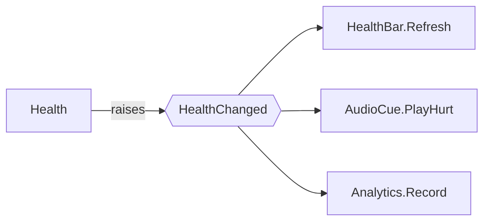

# Delegates, events, Action and Func

## What this unblocks

Later in the module you will build event channels: a health bar that updates itself when health changes, without the health system knowing a health bar exists. The channel holds a list of interested parties and calls them when something happens. That list is a delegate, and the mechanism that stops outsiders from tampering with it is `event`.

This is the note where most of the wiring in the rest of the module comes from. The order below matters, because each step is the previous one with a restriction or a shorthand added.

## The idea

A delegate is a variable that holds a method.

That is genuinely all it is. You are used to variables holding an `int` or an `Enemy`. A delegate variable holds *something you can call*, and calling the variable runs whatever method is currently in it. Assign a different method and the same call site does something different.

Why that matters: it lets one object hand another object a piece of behaviour to run later, without the two knowing anything about each other. The health system does not need a reference to the health bar. It needs a list of things to call, and the health bar puts itself on that list.



`Health` has one arrow out and knows nothing about the three boxes on the right. Any of them can be removed, or a fourth added, without `Health` changing.

## In code

### A delegate is a method reference

A delegate type declares a signature. Any method matching that signature can be stored in a variable of that type.

```csharp
/// <summary>
/// Handles a change in health.
/// </summary>
/// <param name="newHealth">The health value after the change.</param>
public delegate void HealthChangedHandler(int newHealth);
```

```csharp
public class HealthBar
{
    /// <summary>
    /// Redraws the bar for the supplied health value.
    /// </summary>
    /// <param name="newHealth">The health value to display.</param>
    public void Refresh(int newHealth)
    {
        // Resize the bar.
    }
}
```

```csharp
HealthBar bar = new HealthBar();

HealthChangedHandler handler = bar.Refresh;   // store the method, do not call it
handler(75);                                  // now call it: runs bar.Refresh(75)
```

Look carefully at the assignment. There are no brackets after `bar.Refresh`. `bar.Refresh(75)` calls the method; `bar.Refresh` *is* the method. Getting this wrong is the single most common error in this topic.

### One delegate, many methods

Delegates are multicast. `+=` adds a method to the list, `-=` removes one, and invoking the delegate calls everything on the list in the order it was added.

```csharp
HealthChangedHandler handler = bar.Refresh;
handler += audioCue.PlayHurt;
handler += analytics.Record;

handler(75);            // calls all three

handler -= audioCue.PlayHurt;
handler(60);            // calls the remaining two
```

A delegate with nothing in it is `null`, not an empty list. That detail causes a crash later in this note, so keep it in mind.

### Why `event` exists

Here is the same thing as a field on a class, which is what you would write if you had only the tools above:

```csharp
public class Health
{
    private int _current = 100;

    // A plain delegate field. Anyone can do anything to this.
    public HealthChangedHandler HealthChanged;

    /// <summary>
    /// Reduces health and notifies subscribers.
    /// </summary>
    /// <param name="amount">Points of damage to apply.</param>
    public void TakeDamage(int amount)
    {
        _current -= amount;
        HealthChanged(_current);
    }
}
```

Because `HealthChanged` is a public field, any code anywhere can do this:

```csharp
health.HealthChanged = bar.Refresh;   // wipes every other subscriber
health.HealthChanged(0);              // raises a fake event from outside
```

Both of those are disasters and neither is an accident you can defend against. One keyword fixes them:

```csharp
public event HealthChangedHandler HealthChanged;
```

`event` restricts what outside code may do to the member. From outside the declaring class, `+=` and `-=` are the only operations permitted. Assignment with `=` will not compile, and neither will invocation. Inside the class, it behaves exactly as before.

That is the entire meaning of `event`: it is a delegate field with the dangerous operations removed for everybody except the owner. Publishers raise, subscribers listen, and the two cannot be confused.

### Raising safely

A delegate with no subscribers is `null`, and calling `null` throws. The line `HealthChanged(_current)` above crashes the moment nothing is listening, which in practice means it crashes on the one machine where the health bar was disabled.

```csharp
public void TakeDamage(int amount)
{
    _current -= amount;
    HealthChanged?.Invoke(_current);
}
```

`?.` checks for null and skips the call if there is nothing there. `Invoke` is the explicit way to call a delegate; `HealthChanged?(...)` is not valid syntax, so the null-conditional form requires it.

**Raise every event this way.** There is no case in this module where the bare call is correct.

### Action and Func

Declaring a delegate type for every signature gets tedious, so the framework supplies two generic families that cover nearly everything.

- `Action` takes no parameters and returns nothing.
- `Action<T>`, `Action<T1, T2>` and so on take parameters and return nothing.
- `Func<TResult>` returns a value.
- `Func<T, TResult>`, `Func<T1, T2, TResult>` and so on take parameters and return a value. **The last type argument is always the return type.**

So the custom delegate declared at the top of this note is unnecessary:

```csharp
public delegate void HealthChangedHandler(int newHealth);   // delete this
public event HealthChangedHandler HealthChanged;            // replace with:

public event Action<int> HealthChanged;
```

Identical behaviour, one less type in the project. `Func` shows up where you need an answer back rather than a notification:

```csharp
/// <summary>
/// Decides whether a target should be engaged.
/// </summary>
public Func<Enemy, bool> ShouldEngage;
```

`Func<Enemy, bool>` takes an `Enemy` and returns a `bool`. Use `Action` for "this happened", `Func` for "what is the answer".

Two limits worth knowing now. `Func` cannot return `void` - that is what `Action` is for. And a multicast `Func` returns only the last subscriber's value, with the rest discarded, so `Func` in a multicast event is almost always a mistake.

### Subscribing and unsubscribing in Unity

A MonoBehaviour subscribes when it is enabled and unsubscribes when it is disabled. Always both, always paired.

```csharp
public class HealthBarView : MonoBehaviour
{
    [SerializeField]
    private Health _health;

    private void OnEnable()
    {
        _health.HealthChanged += Refresh;
    }

    private void OnDisable()
    {
        _health.HealthChanged -= Refresh;
    }

    private void Refresh(int newHealth)
    {
        // Resize the bar.
    }
}
```

`OnEnable` and `OnDisable` are the correct pair, not `Start` and `OnDestroy`. Unity disables an object before destroying it, so `OnDisable` runs in both cases, whereas an object that is merely deactivated never reaches `OnDestroy` and would keep receiving events whilst invisible.

The consequence of skipping `OnDisable` is worth stating plainly. The event holds a reference to `Refresh`, which holds a reference to the `HealthBarView`. That reference keeps the whole object alive as far as the garbage collector is concerned, and the event keeps calling it after the object is supposed to be gone. The symptom is a `MissingReferenceException` raised from a line you deleted the object on, and it is one of the more expensive bugs in Unity to track down. [Note 13](13-null-handling-in-unity.md) explains why the object reports itself as destroyed but the reference is still there.

## Common mistakes

### Calling the method instead of storing it

```csharp
_health.HealthChanged += Refresh(0);        // wrong
```

**Symptom:** The compiler reports either an argument type mismatch or that a method name was expected, depending on the signature. If the method happens to return something delegate-shaped, it compiles and then does nothing you expected.

**Fix:** Remove the brackets. `Refresh` is the method; `Refresh(0)` is the result of running it.

### Using `=` where you meant `+=`

```csharp
private void OnEnable()
{
    _health.HealthChanged = Refresh;        // wrong
}
```

**Symptom:** If the member is a plain delegate field, it compiles and silently removes every other subscriber - so the health bar works and the audio cue mysteriously stops. If the member is an `event`, the compiler tells you that it can only appear on the left hand side of `+=` or `-=`, which is it protecting you. This is the concrete reason to declare events as `event`.

**Fix:** `+=` to subscribe, and declare the member as `event` so the mistake cannot be made from outside.

### Raising an event with no subscribers

```csharp
HealthChanged(_current);                    // wrong
```

**Symptom:** `NullReferenceException` on the raise line. It works during development, because your test scene always has a listener, and it crashes in the build where the listener was on a disabled object.

**Fix:** `HealthChanged?.Invoke(_current);` every time.

### Subscribing without unsubscribing

```csharp
private void OnEnable()
{
    _health.HealthChanged += Refresh;
}

// no OnDisable
```

**Symptom:** Two separate problems that look unrelated. First, `MissingReferenceException` when the event fires after the listener was destroyed. Second, duplicate calls: disabling and re-enabling the object adds a second subscription, so the method now runs twice, then three times, and a damage number appears four times on screen.

**Fix:** Every `+=` in `OnEnable` gets a matching `-=` in `OnDisable`. Write the pair at the same time, before you write anything else in the class. Note that `-=` on a method that was never subscribed is harmless, so there is no cost to being thorough.

## Check yourself

1. What is the difference between `bar.Refresh` and `bar.Refresh(75)`?
2. What exactly does `event` prevent, and who is it preventing it for?
3. What does `Action<int, bool>` return, and what does `Func<int, bool>` return?
4. Why `OnEnable` and `OnDisable` rather than `Start` and `OnDestroy`?
5. Why is `HealthChanged?.Invoke(x)` preferred over `HealthChanged(x)`?

<details>
<summary>Answers</summary>

**1.** `bar.Refresh` is a reference to the method, suitable for storing in a delegate. `bar.Refresh(75)` calls the method immediately and is the value it returned - here, nothing at all.

**2.** It prevents assignment with `=` and direct invocation, from outside the declaring class only. Inside the class that declares it, an event behaves like an ordinary delegate field. So subscribers can only add and remove themselves, and only the owner can raise it.

**3.** `Action<int, bool>` returns nothing; both type arguments are parameters. `Func<int, bool>` takes an `int` and returns a `bool`, because the final type argument to `Func` is always the return type.

**4.** Because Unity disables an object before destroying it, so `OnDisable` runs in both the deactivation and destruction cases. An object that is only deactivated never reaches `OnDestroy`, so it would stay subscribed and keep reacting to events whilst switched off.

**5.** A delegate with no subscribers is `null` rather than an empty list, so the bare call throws a `NullReferenceException`. The null-conditional form skips the call when nothing is listening.

</details>

## Further reading

- [Delegates (C# programming guide)](https://learn.microsoft.com/en-us/dotnet/csharp/programming-guide/delegates/)
- [Events (C# programming guide)](https://learn.microsoft.com/en-us/dotnet/csharp/programming-guide/events/)
- [Order of execution for event functions](https://docs.unity3d.com/Manual/ExecutionOrder.html)

## Lesson Context

```yaml
previous_lesson:
  topic_code: t06_abstract_classes

this_lesson:
  topic_code: t07_delegates_events
  difficulty_tier: Intermediate
mlos: [MLO3]
```
